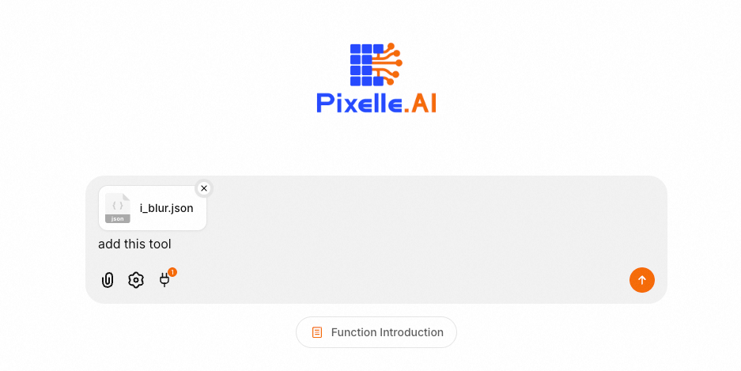
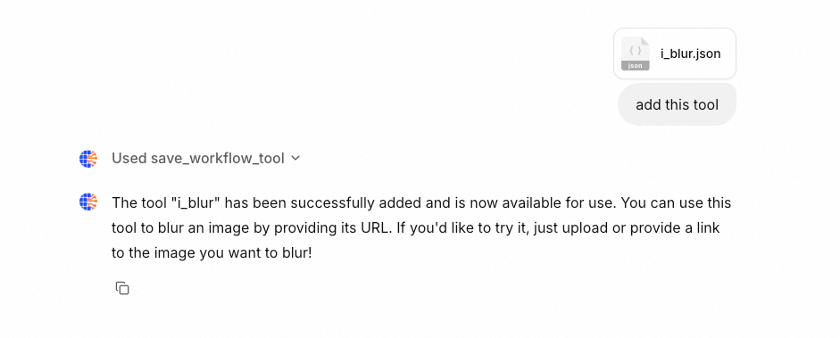
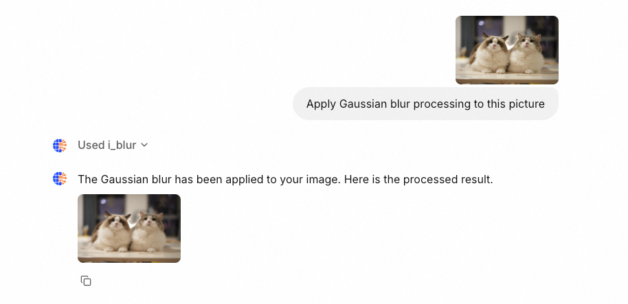

<h1 align="center">🎨 Pixelle MCP - Omnimodal Agent Framework</h1>

<p align="center"><b>English</b> | <a href="README_CN.md">中文</a></p>

<p align="center">✨ An AIGC solution based on the MCP protocol, seamlessly converting ComfyUI workflows into MCP tools with zero code, empowering LLM and ComfyUI integration.</p>

https://github.com/user-attachments/assets/65422cef-96f9-44fe-a82b-6a124674c417

https://github.com/user-attachments/assets/75d80326-191a-4133-8b04-d69e91a3c6b3

https://github.com/user-attachments/assets/e376dea5-4016-4fec-a017-73bb5ab22485

## 📁 Project Structure

- **mcp-base**: 🔧 Basic service, provides file storage and shared service capabilities
- **mcp-client**: 🌐 MCP client, a web interface built on Chainlit
- **mcp-server**: 🗄️ MCP server, provides various AIGC tools and services


<p align="center">Project Structure</p>

## 🚀 Features

- ✅ 🔄 **Full-modal Support**: Supports TISV (Text, Image, Sound/Speech, Video) full-modal conversion and generation
- ✅ 🧩 **ComfyUI Ecosystem**: Server-side is built on [ComfyUI](https://github.com/comfyanonymous/ComfyUI), inheriting all capabilities from the open ComfyUI ecosystem
- ✅ 🔧 **Zero-code Development**: Defines and implements the Workflow-as-MCP Tool solution, enabling zero-code development and dynamic addition of new MCP Tools
- ✅ 🗄️ **MCP Server**: Server provides functionality based on the [MCP](https://modelcontextprotocol.io/introduction) protocol, supporting integration with any MCP client (including but not limited to Cursor, Claude Desktop, etc.)
- ✅ 🌐 **MCP Client**: Client is developed based on the [Chainlit](https://github.com/Chainlit/chainlit) framework, inheriting Chainlit's UI controls and supporting integration with more MCP Servers
- ✅ 🔄 **Flexible Deployment**: Supports standalone deployment of Server-side only as MCP Server, or standalone deployment of Client-side only as MCP Client, or combined deployment
- ✅ ⚙️ **Unified Configuration**: Uses YAML configuration scheme, one config file manages all services


## 🏃‍♂️ Quick Start

### 📥 1. Clone the Source Code & Configure Services

#### 📦 1.1 Clone the Source Code

```shell
git clone https://github.com/AIDC-AI/Pixelle-MCP.git
cd Pixelle-MCP
```

#### ⚙️ 1.2 Configure Services

The project uses a unified YAML configuration scheme:

```shell
# Copy the configuration example file
cp config.yml.example config.yml
# Edit configuration items as needed
```

**📋 Detailed Configuration Instructions:**

The configuration file contains three main sections: Basic Service, MCP Server, and MCP Client. Each section has detailed configuration item descriptions in [`config.yml.example`](config.yml.example).

**🔍 Configuration Checklist:**
- ✅ Copied `config.yml.example` to `config.yml`
- ✅ Configured ComfyUI service address (ensure ComfyUI is running)
- ✅ Configured at least one LLM model (OpenAI or Ollama)
- ✅ Port numbers are not occupied by other services (9001, 9002, 9003)

### 🔧 2. Add MCP Tool (Optional)

This step is optional and only affects your Agent's capabilities. You can skip it if not needed for now.

The `mcp-server/workflows` directory contains a set of popular workflows by default. Run the following command to copy them to your mcp-server. When the service starts, they will be automatically converted into MCP Tools for LLM use.

**Note: It is strongly recommended to test the workflow in your ComfyUI canvas before copying, to ensure smooth execution later.**

```shell
cp -r mcp-server/workflows/* mcp-server/data/custom_workflows/
```

### 🚀 3. Start the Services

#### 🎯 3.1 Start with Docker (Recommended)

```shell
# Start all services
docker compose up -d
```

#### 🛠️ 3.2 One-click Script Start

Requires [uv](https://docs.astral.sh/uv/getting-started/installation/) environment.

**Linux/macOS users:**
```shell
# Start all services (foreground)
./run.sh

# Or

# Start all services (background)
./run.sh start --daemon
```

**Windows users:**

Simply double-click the `run.bat` script in the root directory

#### 🛠️ 3.3 Manual Service Start

Requires [uv](https://docs.astral.sh/uv/getting-started/installation/) environment.

**Start Basic Service (mcp-base):**
```shell
cd mcp-base
# Install dependencies (only needed on first run or after updates)
uv sync
# Start service
uv run main.py
```

**Start Server (mcp-server):**
```shell
cd mcp-server
# Install dependencies (only needed on first run or after updates)
uv sync
# Start service
uv run main.py
```

**Start Client (mcp-client):**
```shell
cd mcp-client
# Install dependencies (only needed on first run or after updates)
uv sync
# Start service (for hot-reload in dev mode: uv run chainlit run main.py -w --port 9003)
uv run main.py
```


### 🌐 4. Access the Services

After startup, the service addresses are as follows:

- **Client**: 🌐 http://localhost:9003 (Chainlit Web UI, default username and password are both `dev`, can be changed in [`auth.py`](mcp-client/auth/auth.py))
- **Server**: 🗄️ http://localhost:9002/sse (MCP Server)
- **Base Service**: 🔧 http://localhost:9001/docs (File storage and basic API)

## 🛠️ Add Your Own MCP Tool

⚡ One workflow = One MCP Tool

### 🎯 1. Add the Simplest MCP Tool

* 📝 Build a workflow in ComfyUI for image Gaussian blur ([Get it here](docs/i_blur_ui.json)), then set the `LoadImage` node's title to `$image.image!` as shown below:


* 📤 Export it as an API format file and rename it to `i_blur.json`. You can export it yourself or use our pre-exported version ([Get it here](docs/i_blur.json))

* 📋 Copy the exported API workflow file (must be API format), input it on the web page, and let the LLM add this Tool

  

* ✨ After sending, the LLM will automatically convert this workflow into an MCP Tool

  

* 🎨 Now, refresh the page and send any image to perform Gaussian blur processing via LLM

  

### 🔌 2. Add a Complex MCP Tool

The steps are the same as above, only the workflow part differs (Download workflow: [UI format](docs/t2i_by_flux_turbo_ui.json) and [API format](docs/t2i_by_flux_turbo.json))


## 🔧 ComfyUI Workflow Custom Specification

### 🎨 Workflow Format
The system supports ComfyUI workflows. Just design your workflow in the canvas and export it as API format. Use special syntax in node titles to define parameters and outputs.

### 📝 Parameter Definition Specification

In the ComfyUI canvas, double-click the node title to edit, and use the following DSL syntax to define parameters:

```
$<param_name>.<field_name>[!][:<description>]
```

#### 🔍 Syntax Explanation:
- `param_name`: The parameter name for the generated MCP tool function
- `field_name`: The corresponding input field in the node
- `!`: Indicates this parameter is required
- `description`: Description of the parameter

#### 💡 Example:

**Required parameter example:**

- Set LoadImage node title to: `$image.image!:Input image URL`
- Meaning: Creates a required parameter named `image`, mapped to the node's `image` field

**Optional parameter example:**

- Set EmptyLatentImage node title to: `$width.width:Image width, default 512`
- Meaning: Creates an optional parameter named `width`, mapped to the node's `width` field, default value is 512

### 🎯 Type Inference Rules

The system automatically infers parameter types based on the current value of the node field:
- 🔢 `int`: Integer values (e.g. 512, 1024)
- 📊 `float`: Floating-point values (e.g. 1.5, 3.14)
- ✅ `bool`: Boolean values (e.g. true, false)
- 📝 `str`: String values (default type)

### 📤 Output Definition Specification

#### 🤖 Method 1: Auto-detect Output Nodes
The system will automatically detect the following common output nodes:
- 🖼️ `SaveImage` - Image save node
- 🎬 `SaveVideo` - Video save node
- 🔊 `SaveAudio` - Audio save node
- 📹 `VHS_SaveVideo` - VHS video save node
- 🎵 `VHS_SaveAudio` - VHS audio save node

#### 🎯 Method 2: Manual Output Marking
> Usually used for multiple outputs
Use `$output.var_name` in any node title to mark output:
- Set node title to: `$output.result`
- The system will use this node's output as the tool's return value


### 📄 Tool Description Configuration (Optional)

You can add a node titled `MCP` in the workflow to provide a tool description:

1. Add a `String (Multiline)` or similar text node (must have a single string property, and the node field should be one of: value, text, string)
2. Set the node title to: `MCP`
3. Enter a detailed tool description in the value field


### ⚠️ Important Notes

1. **🔒 Parameter Validation**: Optional parameters (without !) must have default values set in the node
2. **🔗 Node Connections**: Fields already connected to other nodes will not be parsed as parameters
3. **🏷️ Tool Naming**: Exported file name will be used as the tool name, use meaningful English names
4. **📋 Detailed Descriptions**: Provide detailed parameter descriptions for better user experience
5. **🎯 Export Format**: Must export as API format, do not export as UI format


## 💬 Community

Scan the QR codes below to join our communities for latest updates and technical support:

|                      Discord Community                       |                         WeChat Group                         |
| :----------------------------------------------------------: | :----------------------------------------------------------: |
|  |  |

## 🤝 How to Contribute

We welcome all forms of contribution! Whether you're a developer, designer, or user, you can participate in the project in the following ways:

### 🐛 Report Issues
* 📋 Submit bug reports on the [Issues](https://github.com/AIDC-AI/Pixelle-MCP/issues) page
* 🔍 Please search for similar issues before submitting
* 📝 Describe the reproduction steps and environment in detail

### 💡 Feature Suggestions
* 🚀 Submit feature requests in [Issues](https://github.com/AIDC-AI/Pixelle-MCP/issues)
* 💭 Describe the feature you want and its use case
* 🎯 Explain how it improves user experience

### 🔧 Code Contributions

#### 📋 Contribution Process
1. 🍴 Fork this repo to your GitHub account
2. 🌿 Create a feature branch: `git checkout -b feature/your-feature-name`
3. 💻 Develop and add corresponding tests
4. 📝 Commit changes: `git commit -m "feat: add your feature"`
5. 📤 Push to your repo: `git push origin feature/your-feature-name`
6. 🔄 Create a Pull Request to the main repo

#### 🎨 Code Style
* 🐍 Python code follows [PEP 8](https://pep8.org/) style guide
* 📖 Add appropriate documentation and comments for new features

### 🧩 Contribute Workflows
* 📦 Share your ComfyUI workflows with the community
* 🛠️ Submit tested workflow files
* 📚 Add usage instructions and examples for workflows

## 🙏 Acknowledgements

❤️ Sincere thanks to the following organizations, projects, and teams for supporting the development and implementation of this project.

* 🧩 [ComfyUI](https://github.com/comfyanonymous/ComfyUI)
* 💬 [Chainlit](https://github.com/Chainlit/chainlit)

* 🔌 [MCP](https://modelcontextprotocol.io/introduction)
* 🎬 [WanVideo](https://github.com/Wan-Video/Wan2.1)
* ⚡ [Flux](https://github.com/black-forest-labs/flux)

## License
This project is released under the MIT License ([LICENSE](LICENSE), SPDX-License-identifier: MIT).
